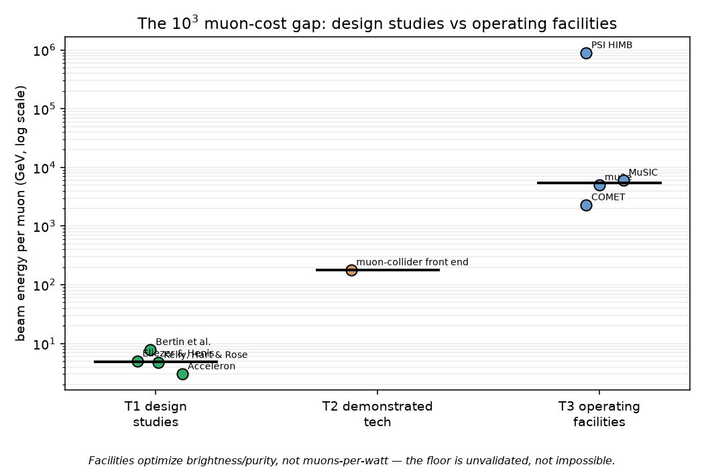

# MUON_COST.md -- the open muon-cost ledger (auto-generated by `scripts/generate_mucost.py`)

> **Curated compilation with provenance, NOT an evaluation.** The single auditable basis is BEAM energy
> per muon in GeV (`normalized_GeV_per_stopped_mu`); wall-plug = that / eta_acc (kept in its own column,
> never folded). T3 facility rows are ORIGINAL DERIVATIONS ("implied, derived here, formula shown") --
> no operating facility reports GeV-per-stopped-muon. An accounting credit (Kelly's x2.5 recapture) is
> recorded in its own flagged column, never folded into the normalized value.

## Headline
The purpose-built muon-source **design studies** put the muon cost at a few GeV per muon. The open-access
anchor is **Kelly, Hart & Rose (2021): 4.70 GeV/muon** (G4Beamline;
deuteron on a tungsten target; DOI 10.1088/2515-7655/abfb4b) -- the only fully reader-checkable row,
which reports its own eta_acc=0.18 (PSI-measured) and Q_elec=14% at X_mu=150. Two further full-text-verified
design studies corroborate the same single-GeV scale: **Bertin et al. (1987), ~7.80
GeV/muon** at liquid density (DOI 10.1209/0295-5075/4/8/003; ~3 GeV ideal all-collected) and
**Eliezer & Henis (1994), ~5.0 GeV/muon** (DOI 10.13182/FST94-A30300).

**Operating muon facilities are ~10^3 worse.** The tier-median muon cost rises from **4.85
GeV** (design studies) through **178 GeV** (demonstrated technology, collected-not-stopped)
to **5497.5 GeV** (operating facilities) -- a **1133.5x** gap. That gap is the finding.
needs_verification (Jandel) and slide-tier (Acceleron) rows carry visible flags below and never headline.

## Normalization basis (read before the tables)
The auditable basis is **beam (kinetic) energy per muon**, expressed in GeV -- the quantity every source
reports (as beam energy per pi-, per created muon, per stopped muon, or per collected muon; see each row's
`basis_as_published`). Two factors are deliberately kept SEPARATE and never folded into the normalized
value: **wall-plug efficiency** (`eta_acc`: wall-plug per muon = normalized / eta_acc; e.g. Kelly's
PSI-measured 0.18) and any **recapture/breeding credit** (`recapture_factor`: Kelly's x2.5 is recorded but
`recapture_credit_applied=false`). "Per stopped muon" and "per produced/collected muon" differ by the
stopping fraction (a per-produced figure is a lower bound on the per-stopped cost); each row states which
it is. T3 facility rows report no such cost themselves, so their GeV/muon is an ORIGINAL DERIVATION with
the arithmetic shown in the row's `derivation` field (verbatim in the CSV).

## Tier 1 -- purpose-built muon-source design studies
| source | value as published | GeV/muon (normalized) | nv | basis / notes |
|---|---|---|---|---|
| Kelly, Hart & Rose (2021) | 4.70 GeV/muon | 4.70 | no | beam energy per negative muon created (deuteron beam, tungsten target |
| Bertin et al. (1987) | 7.8 +- 1.8 GeV (n-beam 3.5 GeV/c, rho_0) | 7.80 | no | beam kinetic energy per muon (C_mu-) |
| Eliezer & Henis (1994) | ~5 GeV (~5000 MeV) per muon | 5.0 | no | energy to produce one negative muon (~5000 MeV, optimistic estimate) |
| Jandel (1989) | (not pinned) | -- (not pinned) | **yes** | (not pinned -- primary not in hand) |
| Acceleron (2025 deck) | 3.0 GeV per pi-/muon exiting target | 3.0 | no | energy per negative pion and muon EXITING the active target (GEANT4 sim) |

## Tier 2 -- demonstrated technology
| source | value as published | GeV/muon (normalized) | nv | basis / notes |
|---|---|---|---|---|
| muon-collider front end | 0.045 mu/proton (post-cooling); 0.8 mu/proton (at capture) | 178 | no | muons per proton, COLLECTED for a collider (NOT stopped in fuel): ~0.8 mu/p at capture (constant solenoid) |

## Tier 3 -- operating facilities (GeV/stopped-mu derived here)
Each GeV/muon below is *implied, derived here* from public beam-power / muon-rate numbers (the full
arithmetic is in the CSV `derivation` column); no facility reports this quantity. PSI HIMB is mu+-ONLY
(surface muons) and thus irrelevant to muCF, which needs mu- -- listed for scale only.

| source | value as published | GeV/muon (normalized) | nv | basis / notes |
|---|---|---|---|---|
| mu2e (Fermilab) | 8 kW @ 8 GeV; ~1e10 stopped mu/s | 4993 | no | 8 GeV protons, 8 kW production-target beam |
| COMET (J-PARC) | 0.0035 mu/proton; 56 kW @ 8 GeV | 2286 | no | 8 GeV, 56 kW (7 uA) proton beam |
| MuSIC (RCNP) | (10.4 +- 2.7)e5 mu/W (mu+ and mu-) | 6002 | no | measured (10.4 +- 2.7)e5 muons per Watt of 400 MeV proton beam power (mu+ and mu-) |
| PSI HIMB | 1.42 MW; 1e10 mu+/s (mu+-only) | 890000 | no | 1.42 MW HIPA 590 MeV proton beam |

## The 10^3 simulation-to-facility gap

**Figure `figures/muon_cost_gap.png` (log-scale GeV/muon by tier).** Caption: *Facilities optimize brightness/purity, not muons-per-watt — the floor is unvalidated, not impossible.*

The ~1133.5x tier-median gap (4.85 GeV design-study -> 5497.5 GeV facility)
is not a claim that the design-study floor is unreachable. Existing facilities are built for beam
brightness and purity, not muons-per-watt; the floor is **unvalidated, not impossible**. This is a
normalization no facility publishes, presented as a reader-checkable compilation, not a verdict on any
program. (E_mu single accounting home: the rate-ledger `E_mu_cost` row points here.)
