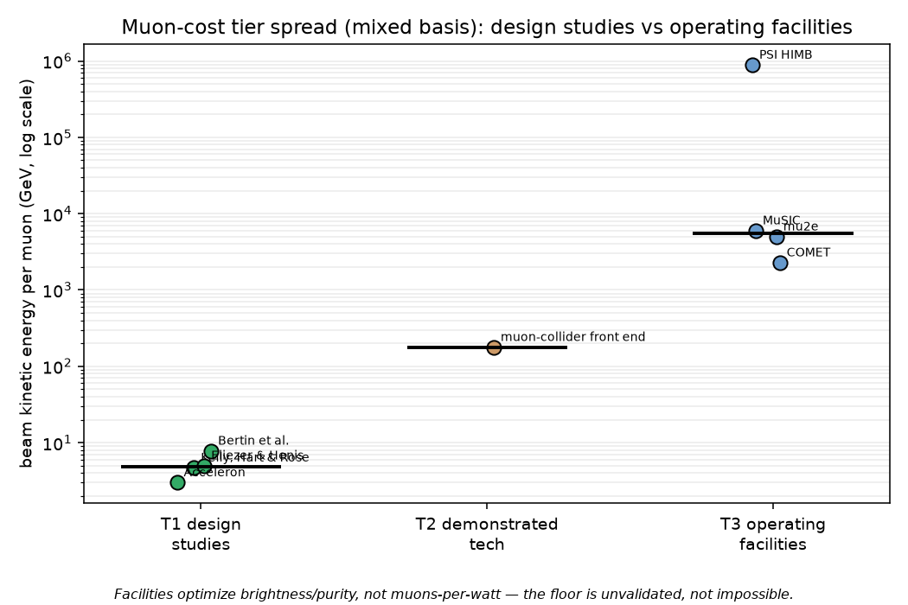

# MUON_COST.md -- the open muon-cost ledger (auto-generated by `scripts/generate_mucost.py`)

> **Curated compilation with provenance, NOT an evaluation.** `normalized_GeV_per_mu` is BEAM energy per
> muon in GeV **on each row's own accounting basis** (`basis_class`) -- these rows are **NOT all on a
> common basis and are not commensurable across classes**. Wall-plug = normalized / eta_acc (kept in its
> own column, never folded). T3 facility rows are ORIGINAL DERIVATIONS ("implied, derived here, formula
> shown") -- no operating facility reports GeV-per-stopped-muon. An accounting credit (Kelly's x2.5
> recapture) is recorded in its own flagged column, never folded into the normalized value.

## Headline
The purpose-built muon-source **design studies** put the muon cost at a few GeV per muon. The open-access
anchor is **Kelly, Hart & Rose (2021): 4.70 GeV/muon** (G4Beamline;
deuteron on a tungsten target; DOI 10.1088/2515-7655/abfb4b) -- the only fully reader-checkable row,
which reports its own eta_acc=0.18 (PSI-measured) and Q_elec=14% at X_mu=150. Two further
full-text-verified design studies corroborate the same single-GeV scale: **Bertin et al. (1987),
~7.80 GeV/muon** at liquid density (DOI 10.1209/0295-5075/4/8/003; ~3 GeV ideal
all-collected) and **Eliezer & Henis (1994), ~5.0 GeV/muon**
(DOI 10.13182/FST94-A30300).

**Those single-GeV figures are beam energy per muon PRODUCED, not the loaded cost of a muon stopped in
D-T fuel.** On Kelly's own numbers the wall-plug-equivalent is 4.70 /
0.18 = **26.1 GeV per muon produced** -- and that is still a LOWER BOUND
on the wall-plug cost per mu- actually stopped in D-T, because the collection and stopping fractions
(both < 1) have not been applied. Every factor omitted here pushes the cost UP, so the bound is one-sided.

**Operating muon facilities are ~10^3 worse.** The tier-median rises from **4.85
GeV** (design studies) through **178 GeV** (demonstrated technology, collected-not-stopped)
to **5497.5 GeV** (operating facilities) -- nominally **1133.5x**. **That ratio is
NOT a same-basis comparison and must not be quoted as one.** T1 contains {produced, stopped_in_dt} rows and T3
contains {collected, stopped_other_target} rows; basis classes shared between the two tiers: **none**.
With no shared class, a same-basis T1-vs-T3 ratio is **not computable from these rows** -- and because
both the numerator and the denominator contain lower-bound (per-produced / per-collected) figures, the
ratio is not cleanly bounded in either direction. The defensible statement is the **order of magnitude**
(~10^3), driven by technology, with the basis composition disclosed above. needs_verification (Jandel)
and slide-tier (Acceleron) rows carry visible flags below and never headline.

## Normalization basis (read before the tables)
Each row's `normalized_GeV_per_mu` is **beam (kinetic) energy per muon on that row's own basis**, recorded
machine-readably in `basis_class`:

- `produced` -- per muon created (Kelly, Eliezer-Henis, Acceleron)
- `stopped_in_dt` -- per muon stopped in the D-T target: the quantity a muCF energy balance actually
  needs (Bertin)
- `collected` -- transported/collected but never stopped in fuel (muon-collider front end, MuSIC, PSI HIMB)
- `stopped_other_target` -- stopped in a NON-D-T target, e.g. mu2e's aluminium stopping target (mu2e, COMET)

A `produced` or `collected` figure is a **lower bound** on the `stopped_in_dt` cost, since collection and
stopping fractions are both < 1. `charge_basis` records what is counted: MuSIC's figure is `mixed`
(mu+ and mu- together, so the mu--only cost is roughly 2x higher) and PSI HIMB is `mu_plus_only` --
irrelevant to muCF, which needs mu-, and listed for scale only.

Two factors are deliberately kept SEPARATE and never folded into the normalized value: **wall-plug
efficiency** (`eta_acc`, the electrical -> muon-beam efficiency, e.g. Kelly's PSI-measured
0.18; wall-plug per muon = normalized / eta_acc -- this is an energy-accounting
conversion, **not** a collection or stopping correction) and any **recapture/breeding credit**
(`recapture_factor`: Kelly's x2.5 is recorded but `recapture_credit_applied=false`). T3 facility rows
report no such cost themselves, so their GeV/muon is an ORIGINAL DERIVATION with the arithmetic shown in
the row's `derivation` field (verbatim in the CSV).

## Tier 1 -- purpose-built muon-source design studies
| source | value as published | GeV/muon (normalized) | basis_class | charge | nv | basis / notes |
|---|---|---|---|---|---|---|
| Kelly, Hart & Rose (2021) | 4.70 GeV/muon | 4.70 | produced (lower bound) | mu_minus | no | beam energy per negative muon created (deuteron beam, tungsten target |
| Bertin et al. (1987) | 7.8 +- 1.8 GeV (n-beam 3.5 GeV/c, rho_0) | 7.80 | stopped_in_dt | mu_minus | no | beam kinetic energy per muon (C_mu-) |
| Eliezer & Henis (1994) | ~5 GeV (~5000 MeV) per muon | 5.0 | produced (lower bound) | mu_minus | no | energy to produce one negative muon (~5000 MeV, optimistic estimate) |
| Jandel (1989) | (not pinned) | -- (not pinned) | -- | -- | **yes** | (not pinned -- primary not in hand) |
| Acceleron (2025 deck) | 3.0 GeV per pi-/muon exiting target | 3.0 | produced (lower bound) | mu_minus | no | energy per negative pion and muon EXITING the active target (GEANT4 sim) |

## Tier 2 -- demonstrated technology
| source | value as published | GeV/muon (normalized) | basis_class | charge | nv | basis / notes |
|---|---|---|---|---|---|---|
| muon-collider front end | 0.045 mu/proton (post-cooling); 0.8 mu/proton (at capture) | 178 | collected (lower bound) | mu_minus | no | muons per proton, COLLECTED for a collider (NOT stopped in fuel): ~0.8 mu/p at capture (constant solenoid) |

## Tier 3 -- operating facilities (GeV/stopped-mu derived here)
Each GeV/muon below is *implied, derived here* from public beam-power / muon-rate numbers (the full
arithmetic is in the CSV `derivation` column); no facility reports this quantity. PSI HIMB is mu+-ONLY
(surface muons) and thus irrelevant to muCF, which needs mu- -- listed for scale only.

| source | value as published | GeV/muon (normalized) | basis_class | charge | nv | basis / notes |
|---|---|---|---|---|---|---|
| mu2e (Fermilab) | 8 kW @ 8 GeV; ~1e10 stopped mu/s | 4993 | stopped_other_target | mu_minus | no | 8 GeV protons, 8 kW production-target beam |
| COMET (J-PARC) | 0.0035 mu/proton; 56 kW @ 8 GeV | 2286 | stopped_other_target | mu_minus | no | 8 GeV, 56 kW (7 uA) proton beam |
| MuSIC (RCNP) | (10.4 +- 2.7)e5 mu/W (mu+ and mu-) | 6002 | collected (lower bound) | mixed | no | measured (10.4 +- 2.7)e5 muons per Watt of 400 MeV proton beam power (mu+ and mu-) |
| PSI HIMB | 1.42 MW; 1e10 mu+/s (mu+-only) | 890000 | collected (lower bound) | mu_plus_only (not muCF) | no | 1.42 MW HIPA 590 MeV proton beam |

## The 10^3 simulation-to-facility gap

**Figure `figures/muon_cost_gap.png` (log-scale GeV/muon by tier).** Caption: *Facilities optimize brightness/purity, not muons-per-watt — the floor is unvalidated, not impossible.*

The ~1133.5x tier-median spread (4.85 GeV design-study -> 5497.5 GeV
facility) is **mixed-basis** (see the Headline: shared basis classes between T1 and T3 =
none), so it is quoted here as an order of magnitude and never as a same-basis ratio.
It is also not a claim that the design-study floor is unreachable: existing facilities are built for beam
brightness and purity, not muons-per-watt; the floor is **unvalidated, not impossible**. This is a
normalization no facility publishes, presented as a reader-checkable compilation, not a verdict on any
program. (E_mu single accounting home: the rate-ledger `E_mu_cost` row points here.)

**What would close this properly.** A same-basis comparison needs every row expressed as wall-plug energy
per mu- *stopped in D-T fuel*: beam GeV per mu- produced -> / eta_acc (wall-plug) -> / collection
fraction -> / stopping fraction in D-T -> mu--only. Only the first two steps are sourceable for any row
today (Kelly: 4.70 / 0.18 = 26.1 GeV). The
remaining factors are all < 1, so every published figure in this table is a **lower bound** on that
quantity -- which is why the one-sided reading above is the only defensible one.
